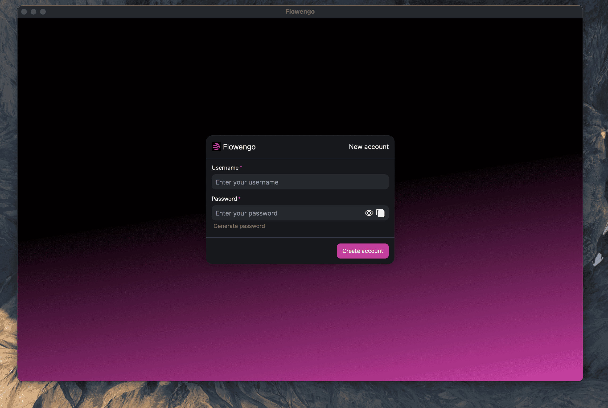
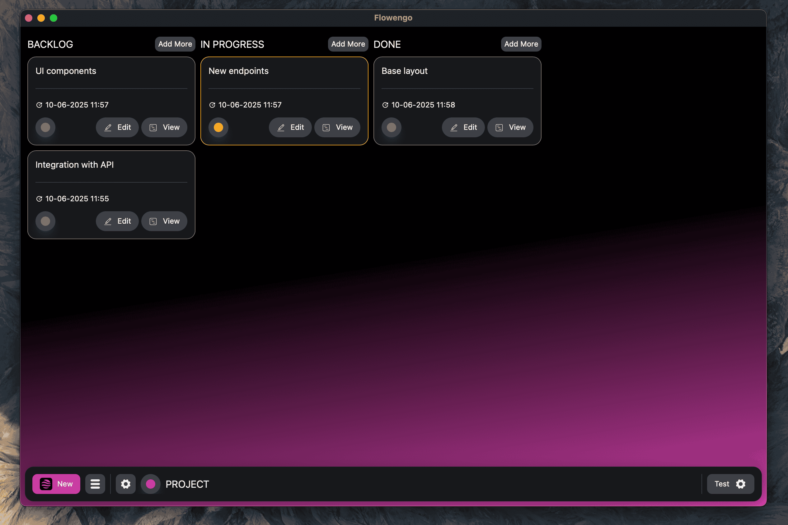
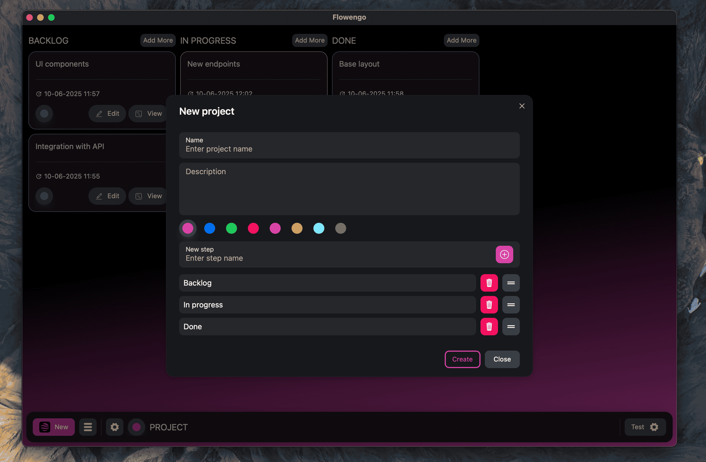
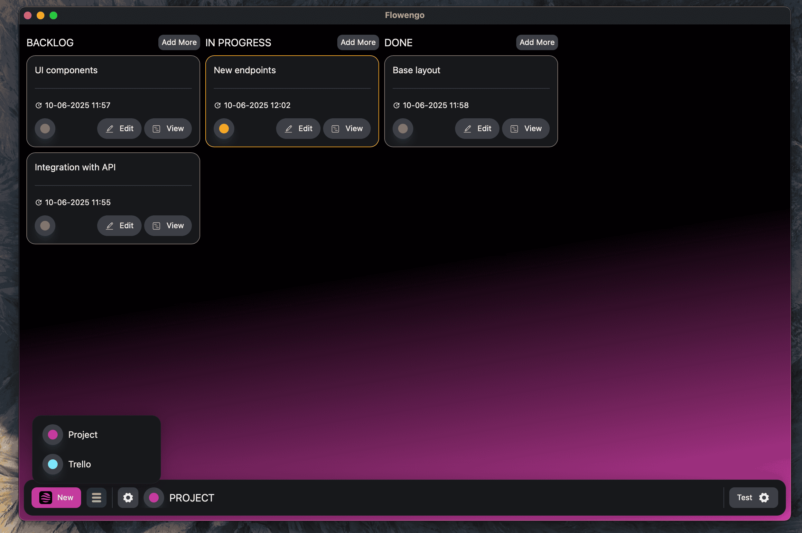
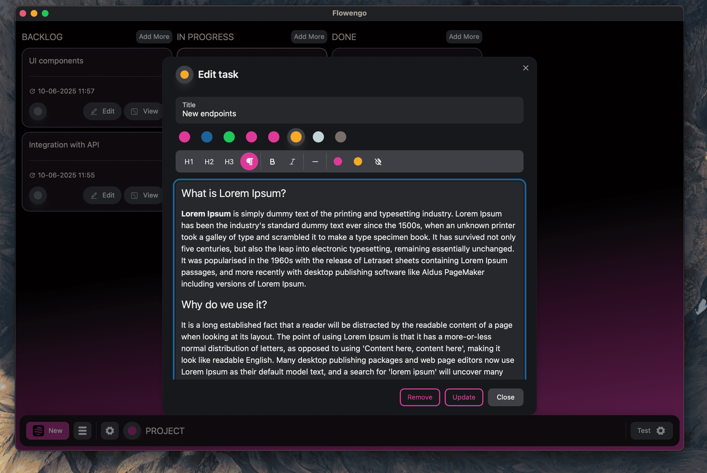
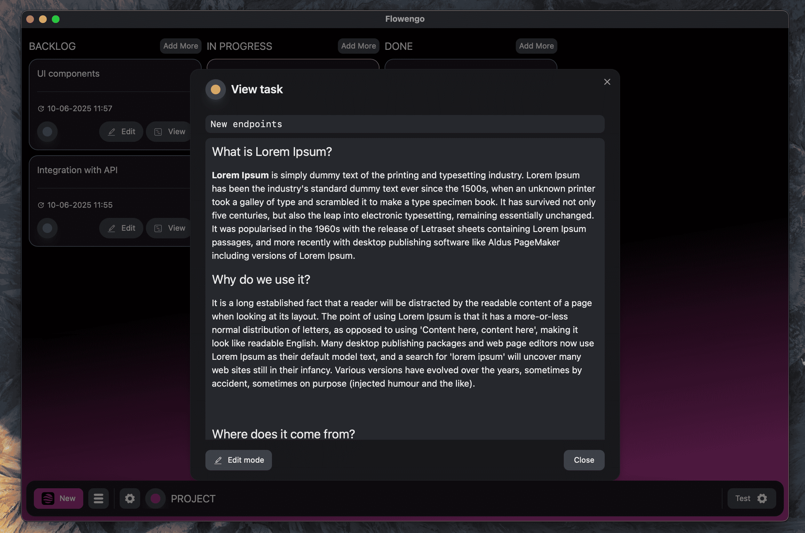
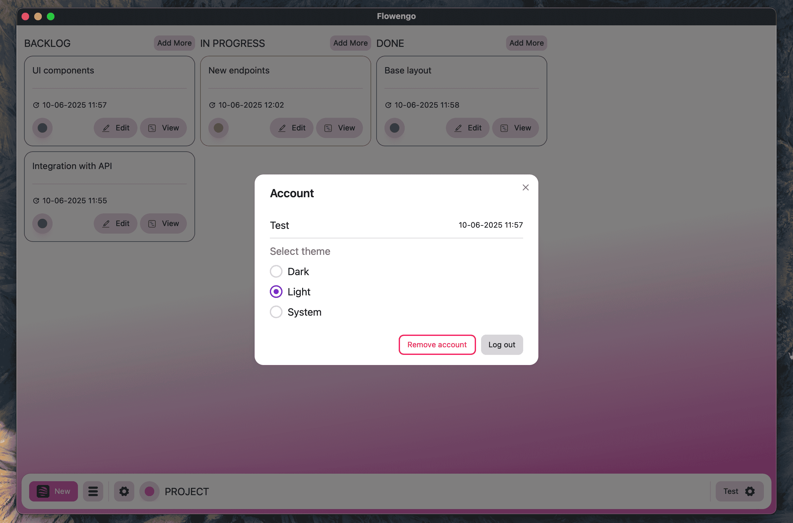

## Flowengo

Flowengo is a clean, fast, and minimalist desktop application for managing tasks with a Kanban-style board. Whether you're planning personal goals, managing work projects, or organizing your daily to-dos, Flowengo helps you stay focused and in control.

Create boards, add task cards, move them across customizable columns, and track your progress—all without distractions, right on your desktop.


### Tech Stack

**Client:** React, TailwindCSS, Rust, Tauri

---

### Crypto

We use cryptography when storing your data on disk.



### Common board

- Fast and intuitive interface.
- Easy navigation
- Moving tasks between columns




### Several boards

- Create multiple projects
- Create custom columns
- Rename them and swap them out.
- Free switching between projects




### Task handling

- Create, modify, move, remove, view tasks
- Use Rich editor for detailed task descriptions




### Theme

- Light and dark mode
- You can use the system theme if your device supports it



---

### Development

Requirements: Rust, Npm, Cargo

Install node dependencies

```bash
npm install
```


Start project:

```bash
npm run tauri dev
```

Generate icons

```bash
npm run tauri icon
```

Build project

```bash
npm run tauri build
```


> Node: v22.13.0 Npm: 10.9.2 Rust: 1.86.0